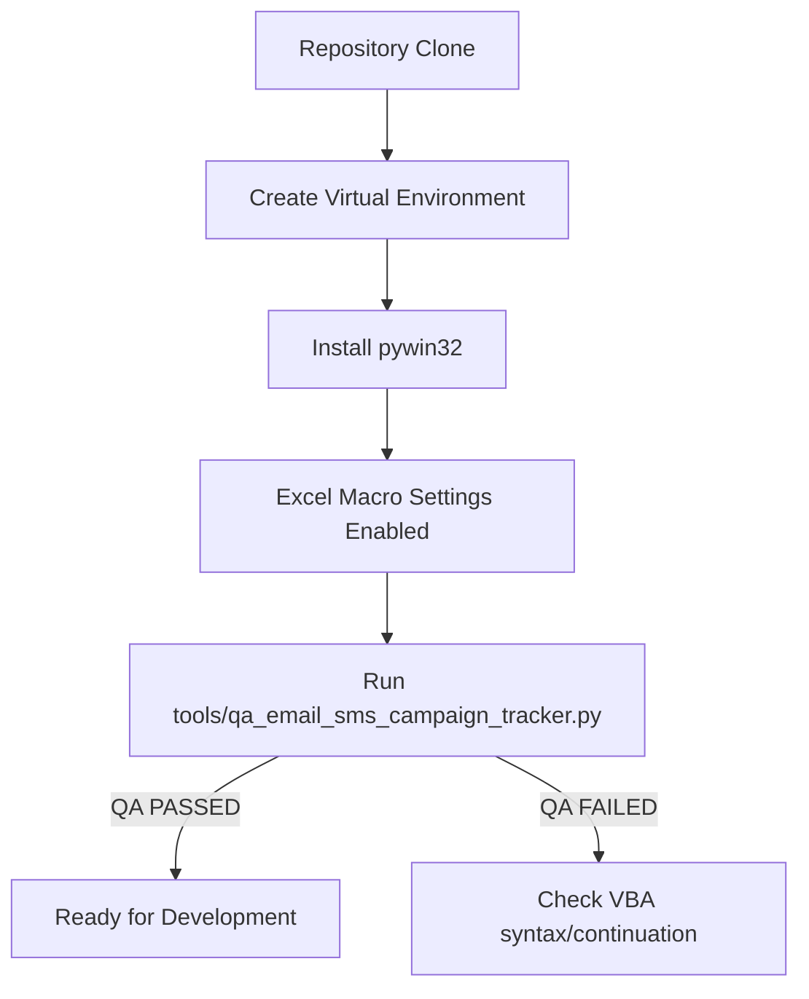

# Tech Stack Setup Guide

## Tech Stack Overview

- **Language:** VBA (Visual Basic for Applications), Python 3.14
- **Framework/Platform:** Microsoft Excel (Desktop and Web), `win32com` (`pywin32`) COM automation
- **Runtime:** CPython (for scripts)
- **Package Manager:** pip (via virtual environment)
- **Key Libraries:** `win32com.client`
- **Version Constraints:** Python >= 3.14 (implied by docs), Desktop Excel with Macros Enabled

## Setup Instructions

### Windows (Primary Development Environment)
1. **Clone the Repository:** 
   ```powershell
   git clone <repository_url>
   cd System-Production-Adorama
   ```
2. **Setup Python Virtual Environment:**
   ```powershell
   python -m venv .venv
   .\.venv\Scripts\Activate.ps1
   ```
3. **Install Dependencies:**
   ```powershell
   pip install pywin32
   ```
4. **Excel Configuration:**
   - Ensure Microsoft Excel is installed on your desktop.
   - Open Excel > Options > Trust Center > Trust Center Settings > Macro Settings.
   - Select "Enable VBA macros" and check "Trust access to the VBA project object model".

### macOS / Linux
> [!WARNING]
> The primary development tooling (`tools/*.py`) relies on `win32com` (Windows COM automation) to drive Excel and interact with the `.xlsm` VBA project. These scripts cannot run on macOS or Linux.

However, the offline static gates can run on any OS:
1. **Setup Python Virtual Environment:**
   ```bash
   python3 -m venv .venv
   source .venv/bin/activate
   ```
2. **Run Static Gates:**
   ```bash
   # py_compile tools for syntax checking
   python3 -m py_compile tools/*.py
   ```

## Architecture & Setup Visualization



## Common Troubleshooting

| Issue | Cause | Solution |
| --- | --- | --- |
| `ImportError: No module named win32com` | Missing pywin32 library | Run `pip install pywin32` inside `.venv` |
| `COMError: Cannot access VBA project` | Excel Trust Center settings | Enable "Trust access to the VBA project object model" in Excel |
| VBA Compile Error: Syntax Error | Blank line after `_` | Ensure line-continuation characters (`_`) are immediately followed by the next code line without blank lines. |
| Dashboard KPI Errors | Expanding table references broken | Run `RefreshDashboard` or use the `tools/fix_...` scripts to repair structural formulas. |

---
*Last Verified: 2026-07-18*
