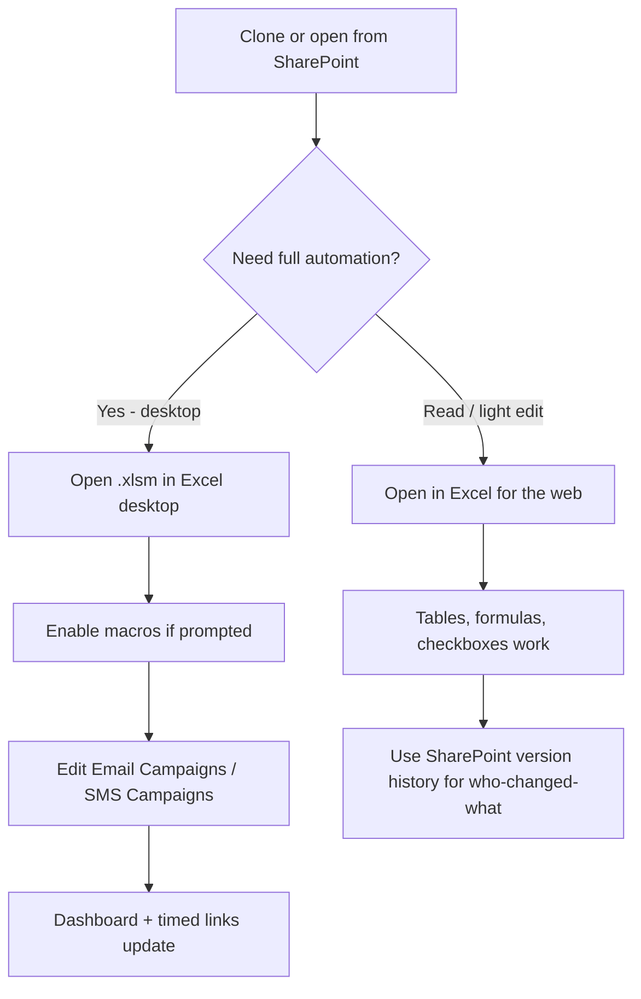
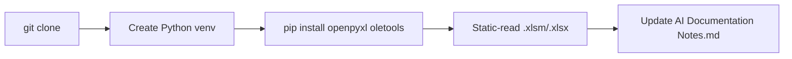

# Tech Stack Setup Guide

Beginner-friendly setup for the **Excel-Spreadsheet-Templates** repository (Adorama campaign and loyalty planners).

---

## Complete Tech Stack

| Layer | Choice | Version / constraint | Notes |
| --- | --- | --- | --- |
| Primary runtime | Microsoft Excel (desktop) | Microsoft 365 Excel recommended | Required for VBA macros in `.xlsm` |
| Secondary runtime | Excel for the web | Current SharePoint / OneDrive Excel Online | Tables, formulas, filters, saved checkbox values only — **no VBA** |
| Macro language | VBA (Visual Basic for Applications) | Hosted inside `.xlsm` workbooks | Module: `modEmailProductionTracker` |
| Macro-free template | Microsoft Excel worksheets / formulas | Dynamic arrays (`LET`, `FILTER`, etc.) preferred | Loyalty plan is pure `.xlsx` |
| Storage / collab | SharePoint (recommended) | Team site document library | Version history is the web audit trail |
| External links | SharePoint monthly Email/SMS planning calendars | Linked via **Data → Edit Links** | Feeds `* Calendar` sheets |
| Optional inspection tools | Python 3.10+ | CPython | **Optional** for maintainers inspecting workbooks offline |
| Optional Python packages | `openpyxl`, `oletools` | Latest pip | Read structure / extract VBA; not required for end users |
| Package manager | pip + venv | — | Only if using optional inspection tools |
| Version control | Git | — | This repository |

**Not present in this repo:** a committed `tools/` automation package or application server. All production runtime behavior for the campaign tracker is **embedded in the `.xlsm` files**.

---

## Who needs what

```text
┌─────────────────────────────────────────────────────────────┐
│                     User personas                           │
├──────────────────────┬──────────────────────────────────────┤
│ Campaign operators   │ Excel desktop or web + SharePoint    │
│ (daily use)          │ Enable macros on desktop for audit   │
│                      │ stamps, Refresh Dashboard, OnTime    │
├──────────────────────┼──────────────────────────────────────┤
│ Template authors /   │ Excel desktop + Trust access to VBA  │
│ maintainers          │ project object model (if editing VBA)│
├──────────────────────┼──────────────────────────────────────┤
│ Doc / AI agents      │ Git clone only; optional Python for  │
│                      │ static scans of .xlsx/.xlsm          │
└──────────────────────┴──────────────────────────────────────┘
```

---

## Setup visualizations

### A. End-user open path (daily work)



### B. Maintainer optional inspection path



### C. Platform capability matrix

| Capability | Excel desktop + macros | Excel for the web |
| --- | :---: | :---: |
| Edit campaign tables | Yes | Yes |
| Filters / sorts | Yes | Yes |
| Native checkboxes / TRUE-FALSE | Yes | Yes (type TRUE/FALSE if needed) |
| Dashboard formulas & KPIs | Yes | Yes (saved formulas) |
| `Last Updated` / `Last Updated By` auto-stamp | Yes | No (manual or SharePoint history) |
| `RefreshDashboard` / format repair | Yes | No |
| Timed link `Application.OnTime` refresh | Yes | No (recalc on open/edit) |
| VBA migration / validation helpers | Yes | No |

---

## Setup instructions

### Windows (primary environment for VBA)

1. **Install Microsoft Excel** (Microsoft 365 desktop app recommended).
2. **Get the files**
   ```powershell
   git clone <repository_url>
   cd Excel-Spreadsheet-Templates
   ```
   Or open the workbooks directly from your SharePoint library.
3. **Open the active tracker**
   - Path: `Adorama\Production Tracker\Email & SMS Campaign Tracker.xlsm`
4. **Enable macros** when Excel prompts. For maintainers who will edit VBA:
   - **File → Options → Trust Center → Trust Center Settings → Macro Settings**
   - Enable VBA macros (per org policy)
   - Check **Trust access to the VBA project object model** only if you need programmatic VBA project access
5. **Optional: Python inspection tools**
   ```powershell
   py -3 -m venv .venv
   .\.venv\Scripts\Activate.ps1
   pip install openpyxl oletools
   ```

### macOS

1. Install **Microsoft Excel for Mac** (Microsoft 365).
2. Clone the repo or open files from SharePoint:
   ```bash
   git clone <repository_url>
   cd Excel-Spreadsheet-Templates
   ```
3. Open the `.xlsm` in Excel for Mac.
   - Macros in this workbook are Windows-oriented in a few places (`Environ("Username")`, some COM assumptions). Core table formulas still work.
   - Prefer SharePoint + Excel for the web for cross-platform collaboration if VBA behavior differs.
4. **Optional Python static inspection** (no `win32com` required for read-only structure):
   ```bash
   python3 -m venv .venv
   source .venv/bin/activate
   pip install openpyxl oletools
   ```

### Linux

1. There is **no official Microsoft Excel desktop** on Linux for full VBA.
2. Recommended approaches:
   - Open workbooks in **Excel for the web** via SharePoint/OneDrive, or
   - Use a Windows VM / remote desktop for macro-enabled work.
3. **Optional offline structure inspection**
   ```bash
   git clone <repository_url>
   cd Excel-Spreadsheet-Templates
   python3 -m venv .venv
   source .venv/bin/activate
   pip install openpyxl oletools
   ```
4. Do **not** convert `.xlsm` → `.xlsx` to “make it open” — that strips VBA.

---

## Workbook quick-start

| Goal | File |
| --- | --- |
| Day-to-day Email/SMS production | `Adorama/Production Tracker/Email & SMS Campaign Tracker.xlsm` |
| Blank / resettable campaign tracker | `Adorama/Production Tracker/Email & SMS Campaign Tracker Template.xlsm` |
| Known-good backup snapshot | `Adorama/Production Tracker/Email & SMS Campaign Tracker_backup.xlsm` |
| Loyalty / PLCC planning (no macros) | `Adorama/Project Tracker/Loyalty and PLCC Email Plan Template.xlsx` |

End-user instructions live on the **`Notes - Instructions`** sheet inside each campaign tracker workbook.

Useful desktop VBA entry points (Alt+F8 or Immediate Window):

| Procedure | Use |
| --- | --- |
| `RefreshDashboard` | Rebuild KPI formulas + Dashboard spill |
| `RefreshProductionStatus` | Broader production refresh |
| `ValidateWorkbookConfiguration` | Configuration health check |
| `ApplyTimedCampaignLinks` | Reinstall timed link formulas |
| `MigrateProductionInventoryStructure` | Structural migration (creates backup first) |

---

## Common troubleshooting

| Issue | Likely cause | Fix |
| --- | --- | --- |
| Macros do nothing / buttons fail | Opened in Excel for the web, or macros disabled | Open in desktop Excel and Enable Content |
| `#VALUE!` on a long Bluecore/Attentive link | URL > 255 chars inside `HYPERLINK` formula | Use the long-link path (platform-name hyperlink); re-run `ApplyTimedCampaignLinks` on desktop |
| Dashboard looks stale | Spill/KPI not recalculated after bulk paste | Desktop: run `RefreshDashboard`; or edit a campaign row to trigger light refresh |
| `#REF!` after sheet/table renames | Broken structured references | Restore table/header names; do not rename `EmailCampaignsTable` / `SMSCampaignsTable` / `DashboardWorkTable` |
| Calendar cells blank | Broken SharePoint external links | **Data → Edit Links** and fix sources; copy `Template for Duplicate` for new months |
| Audit fields not auto-updating | Web client or events disabled | Use desktop Excel with macros; rely on SharePoint version history on web |
| VBA compile error after edit | Blank line immediately after `_` line continuation | Keep continued lines contiguous (no blank line after `_`) |
| Cannot edit Notes sheet | Sheet protection | Unlock with workbook notes password (accidental-edit safeguard only) |
| `ImportError: openpyxl` | Optional Python env missing package | `pip install openpyxl oletools` inside `.venv` |
| Week Number column missing on Active file | Structural variance vs Template | Template/Backup include `Week Number` as column A; Active may start at `Send Date` — align deliberately before migration |

---

## Safety rules for maintainers

1. Keep files as **`.xlsm`** for the campaign tracker (never “save as xlsx” for production copies).
2. Do not rename core table names or campaign headers casually.
3. Do not edit Dashboard helper columns **`AA:AL`** manually.
4. Prefer SharePoint version history before large structural changes.
5. Run `MigrateProductionInventoryStructure` only with intent — it creates a backup and rewrites structure.

---

*Last verified against repository contents: 2026-07-19*
