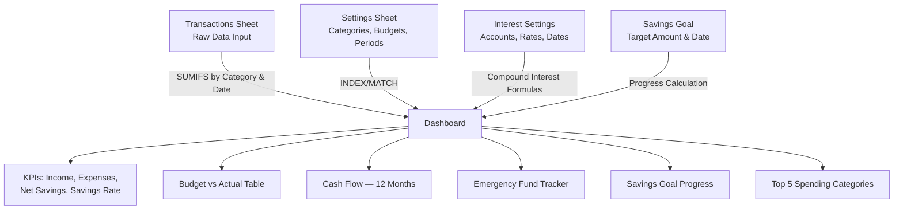
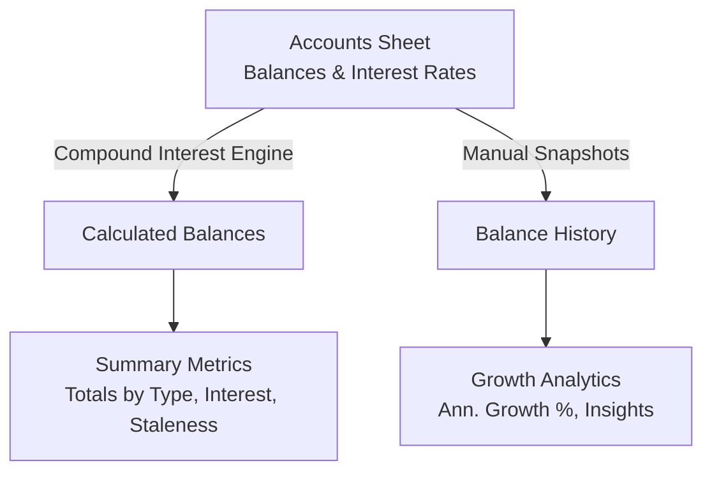
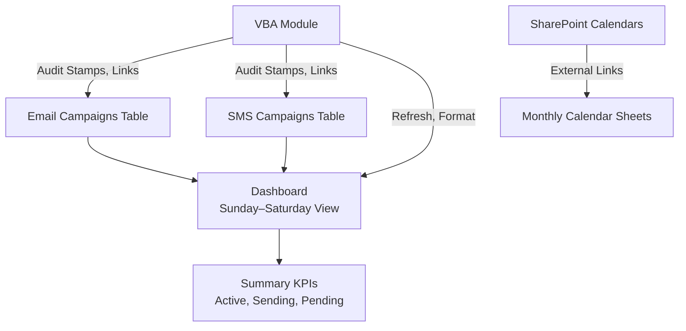

# Tech Stack Setup Guide

## Core Tech Stack

| Component | Personal Savings Tracker | Adorama Campaign Tracker |
| --- | --- | --- |
| **Language / Platform** | Microsoft Excel (Formulas only) | Microsoft Excel (Formulas + VBA) |
| **File Format** | `.xlsx` (no macros) | `.xlsm` (macro-enabled) |
| **Runtime** | Excel Calculation Engine | Excel Calculation Engine + VBA Runtime |
| **Key Functions** | `SUMIFS`, `INDEX`, `MATCH`, `IFERROR`, `EOMONTH`, `DATEDIF`, `LARGE`, `LOOKUP`, `COUNTIF`, `AVERAGEIFS` | Same + VBA `modEmailProductionTracker` |
| **Version** | Excel 2016+ / Microsoft 365 | Excel 2016+ / Microsoft 365 (desktop for VBA) |

## Setup Instructions

### Windows
1. **Install Microsoft Excel** via Microsoft 365 (recommended) or standalone Office 2016+.
2. **Clone or download** the repository to your local machine.
3. **Open** any `.xlsx` file by double-clicking. For `.xlsm` files, click **Enable Content** when prompted.
4. **Enable Editing** if prompted with a "Protected View" banner.
5. The Personal Savings workbooks require **no macros** — formulas calculate automatically.

### macOS
1. **Install Microsoft Excel** for Mac via Microsoft 365.
2. **Clone or download** the repository.
3. **Open** `.xlsx` files directly. For `.xlsm` files, enable macros when prompted.
4. VBA compatibility may vary — core formulas work on all platforms.

### Linux
1. Use **LibreOffice Calc** for `.xlsx` files (full formula compatibility).
2. Alternatively, use **Excel for the Web** via browser (free with Microsoft account).
3. VBA macros (`.xlsm` files) are **not supported** on Linux — use web or Windows/Mac.

## Data Flow Architecture

### Personal Finance Tracker

### Overall Money Tracker

### Adorama Campaign Tracker

## Common Troubleshooting Tips

| Issue | Solution |
| --- | --- |
| **Formulas Not Updating** | Go to `Formulas > Calculation Options` and set to `Automatic` |
| **`#NAME?` Errors** | Ensure you're using Excel 2016+ (older versions may not support `IFERROR`, `EOMONTH`, `DATEDIF`) |
| **`#DIV/0!` Errors** | Should not occur due to `IFERROR` wrappers — verify Settings has non-zero values |
| **Interest shows ₱0** | Check that `Last Updated` date is in the past and `Rate Basis` is exactly `Annual` or `Monthly` |
| **Macros not running** | `.xlsm` files require Excel desktop with macros enabled — not supported on web/Linux |
| **Protected View** | Click `Enable Editing` in the yellow banner when first opening downloaded files |
| **Stale account warnings** | Update the `Last Updated` date in Accounts/Settings after verifying the balance |
