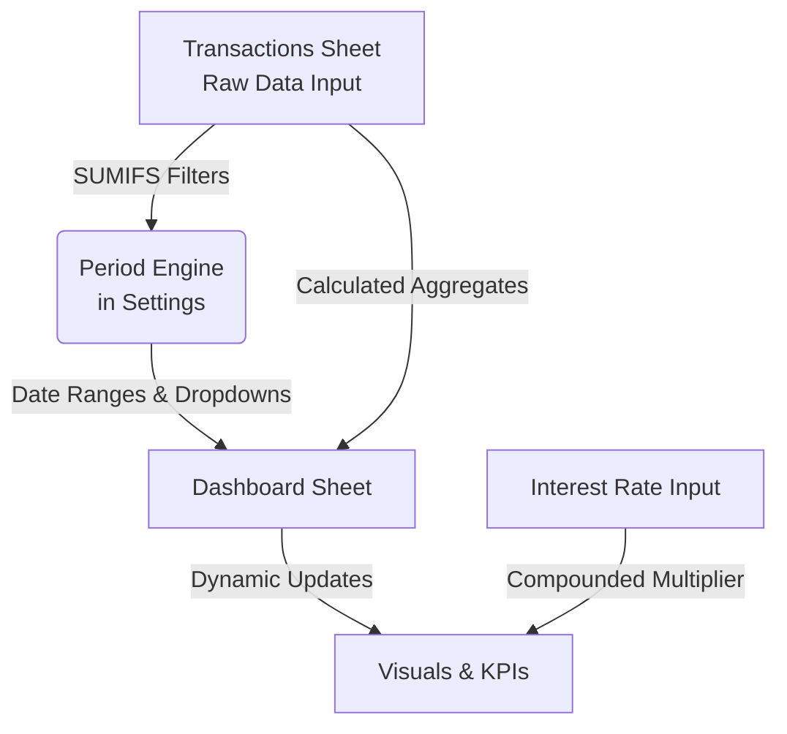

# Tech Stack Setup Guide

## Core Tech Stack
- **Language / Platform**: Microsoft Excel (Formulas only)
- **Framework**: N/A (Native Excel)
- **Runtime**: Excel Calculation Engine
- **Key Libraries**: N/A (Standard Excel Functions: `SUMIFS`, `INDEX`, `MATCH`, `IFERROR`)
- **Version Constraints**: Excel 2016 or newer (due to some array-handling or newer functions like `IFERROR`, `EOMONTH`)

## Setup Instructions

### For Windows, macOS, and Linux
1. **Download the File**: Ensure you have downloaded the `.xlsx` file from the repository to your local machine.
2. **Install a Compatible Editor**:
   - **Windows / macOS**: Install Microsoft Excel (Microsoft 365 recommended).
   - **Linux**: Use a compatible spreadsheet application such as LibreOffice Calc, or use Excel for the Web (via a browser).
3. **Open the File**: Double-click the file to open it in your spreadsheet application.
4. **Enable Editing**: If prompted with a "Protected View" banner at the top, click "Enable Editing" to allow the formulas to calculate.
5. **No Macros Required**: The tracker is entirely formula-based. You do not need to enable macros or install any add-ins.

## Data Flow Architecture

## Common Troubleshooting Tips
- **Formulas Not Updating**: Check if "Calculation Options" is set to "Manual". Go to `Formulas > Calculation Options` and set it to `Automatic`.
- **`#NAME?` Errors**: This usually happens if you are opening the file in an older version of Excel that does not support functions like `SUMIFS` or `IFERROR`.
- **Divide by Zero Errors (`#DIV/0!`)**: This shouldn't happen due to the heavy use of `IFERROR` wrappers, but if it does, verify that your 'Settings' tab has valid, non-zero values where required.
